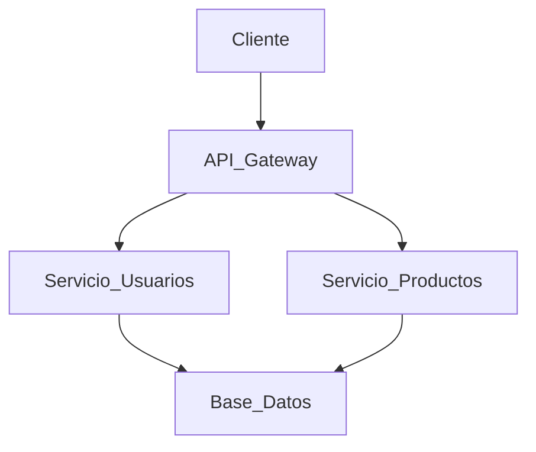

# 🎓 [Nombre de tu Proyecto]

> **Universidad:** UTN
> **Facultad/Escuela:** Regional Haedo
> **Asignatura:** Proyecto Final
> **Año Académico:** 2026

## 📖 Descripción

[Escribe aquí un párrafo detallado sobre qué es el proyecto, qué problema resuelve y por qué se ha desarrollado. Menciona el enfoque principal y el valor que aporta en el contexto de tu asignatura.]

## 📋 Tabla de Contenidos

- [Características Principales](#-características-principales)
- [Tecnologías Utilizadas](#-tecnologías-utilizadas)
- [Arquitectura del Sistema](#-arquitectura-del-sistema)
- [Instalación y Configuración](#-instalación-y-configuración)
- [Uso](#-uso)
- [Estructura del Proyecto](#-estructura-del-proyecto)
- [Autores](#-autores)

## ✨ Características Principales

- **Característica 1:** [Breve explicación, ej. Autenticación de usuarios basada en JWT].
- **Característica 2:** [Breve explicación, ej. Integración con API externa de clima].
- **Característica 3:** [Breve explicación, ej. 

## 🛠 Tecnologías Utilizadas

- **Frontend:** [React / Angular / Vue.js / HTML5 & CSS3]
- **Backend:** [PHP / LARAVEL]
- **Base de Datos:** [PostgreSQL / MySQL / MongoDB]
- **Otras herramientas:** [Docker / Postman / Jest para pruebas]

## 🏗 Arquitectura del Sistema

[Opcional: Puedes incluir una breve descripción del patrón de diseño utilizado (ej. MVC, Microservicios) o incrustar un diagrama si tienes uno.]

