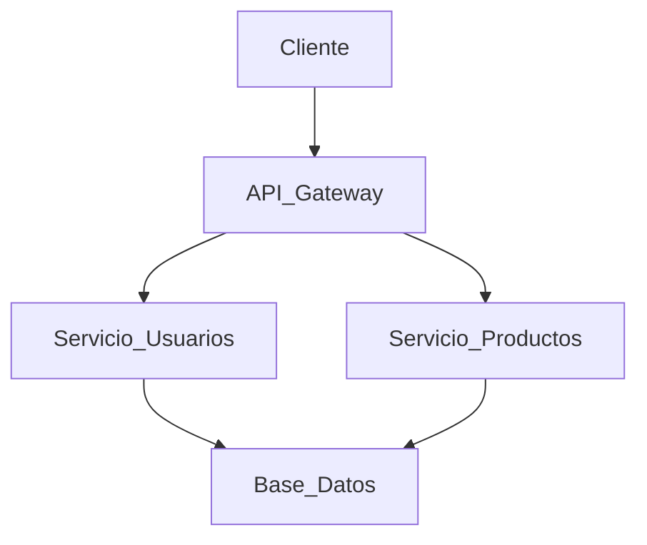

# 🎓 Cursus

> **Universidad:** UTN
> **Facultad/Escuela:** Regional Haedo
> **Asignatura:** Gestion de Desarrollo de Software
> **Año Académico:** 2026

## 📖 Descripción

Muchos estudiantes universitarios enfrentan dificultades para sostener una rutina de estudio, priorizar materias, cumplir plazos y medir su desempeño de forma ordenada. En la práctica, suelen combinar varias herramientas separadas o depender solo de recordatorios informales, lo que aumenta la desorganización y reduce la constancia.

Como respuesta a esa situación, el proyecto desarrolla un asistente estudiantil que centraliza funciones clave de planificación y seguimiento. El sistema está pensado para ofrecer una experiencia clara, enfocada en las necesidades reales del estudiante: saber qué estudiar, cuándo hacerlo, cuánto avanzó y qué decisiones debe tomar para mejorar su rendimiento.

## 📋 Tabla de Contenidos

- [Características Principales](#-características-principales)
- [Tecnologías Utilizadas] Front-end: HTMML, CSS y JS
- [Arquitectura del Sistema](#-arquitectura-del-sistema)
- [Instalación y Configuración](#-instalación-y-configuración)
- [Uso](#-uso)
- [Estructura del Proyecto](#-estructura-del-proyecto)
- [Autores](#-autores)

## ✨ Características Principales

- **Característica 1:** [Breve explicación, ej. Autenticación de usuarios basada en JWT].
- **Característica 2:** [Breve explicación, ej. Integración con API externa de clima].
- **Característica 3:** [Breve explicación, ej. A].

## 🛠 Tecnologías Utilizadas

- **Frontend:** [HTML, CSS y JS]
- **Backend:** [PHP / LARAVEL]
- **Base de Datos:** [ MySQL ]

## 🏗 Arquitectura del Sistema

[Opcional: Puedes incluir una breve descripción del patrón de diseño utilizado (ej. MVC, Microservicios) o incrustar un diagrama si tienes uno.]

