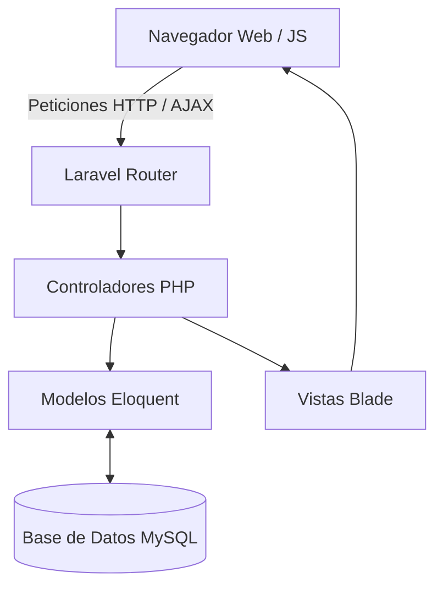

# 🎓 Cursus

> **Universidad:** UTN
> **Facultad/Escuela:** Regional Haedo
> **Asignatura:** Gestión de Desarrollo de Software
> **Año Académico:** 2026
> 
> 

## 📖 Descripción

Muchos estudiantes universitarios enfrentan dificultades para sostener una rutina de estudio, priorizar materias, cumplir plazos y medir su desempeño de forma ordenada. En la práctica, suelen combinar varias herramientas separadas o depender solo de recordatorios informales, lo que aumenta la desorganización y reduce la constancia.
Como respuesta a esa situación, **Cursus** es un asistente estudiantil que centraliza funciones clave de planificación y seguimiento. El sistema está pensado para ofrecer una experiencia clara, enfocada en las necesidades reales del estudiante: saber qué estudiar, cuándo hacerlo, cuánto avanzó y qué decisiones debe tomar para mejorar su rendimiento académico.

## 📋 Tabla de Contenidos

- [Características Principales](#-características-principales)
- [Tecnologías Utilizadas](#-tecnologías-utilizadas)
- [Arquitectura del Sistema](#-arquitectura-del-sistema)
- [Estructura del Proyecto](#-estructura-del-proyecto)

## ✨ Características Principales

- **Gestión de Materias y Correlativas:** Árbol interactivo para planificar la cursada (materias disponibles, en curso, regulares y aprobadas) validando automáticamente las correlatividades.
- **Área de Estudio (Pomodoro):** Herramienta integrada para organizar sesiones de estudio con temporizador Pomodoro y registro de horas invertidas por materia.
- **Seguimiento de Progreso:** Estadísticas detalladas de avance de la carrera, promedio general y cantidad de materias aprobadas.
- **Horarios y Calendario:** Planificador visual para organizar la semana de cursada y estudio.
- **Dashboard Personalizado:** Resumen interactivo con métricas, rachas de estudio y alertas de próximos parciales o entregas.

## 🛠 Tecnologías Utilizadas

- **Lenguaje Principal**: PHP 8.3
- **Framework Backend**: Laravel 11 (Arquitectura MVC, Eloquent ORM, API REST con Laravel Sanctum)
- **Base de Datos**: MySQL (compatible modificando las variables en el `.env`) / MariaDB
- **Frontend**: HTML5, Vanilla CSS (diseño responsivo con variables personalizables y Glassmorphism) y Vanilla Javascript (lógica asíncrona de Fetch API e interactividad dinámica)
- **Inteligencia Artificial**: API de Google Gemini (Gemini 2.5 Flash) para la generación automática de mazos de estudio (Flashcards) y opciones incorrectas (distractores).
- **Procesamiento de Documentos**: Entorno virtual aislado de Python (`venv`) con librerías nativas (`pypdf`, `python-docx`, `python-pptx`) para extraer texto de apuntes académicos (PDF, DOCX, PPTX) de forma robusta e integrarlo con la IA.
- **Iconografía**: Lucide Icons
- **Manejo de Archivos**: Sistema de almacenamiento (`Storage`) local de Laravel para avatars y fondos personalizados.

## 🏗 Arquitectura del Sistema

El proyecto utiliza una arquitectura **Monolítica basada en el patrón MVC (Modelo-Vista-Controlador)** provisto por Laravel, sin depender de microservicios externos.

## 📂 Estructura del Proyecto

El repositorio está organizado de la siguiente manera:

- `/backend/` - Contiene la aplicación web principal desarrollada en Laravel.
- `/prototypes/` - Archivos de diseño preliminar, mockups HTML/CSS puros o pruebas de concepto.
- `/personal/` - Entornos de prueba o notas de los desarrolladores.
  Para ver las instrucciones detalladas de instalación y cómo levantar el entorno de desarrollo, dirígete al [README del Backend](./backend/README.md).
