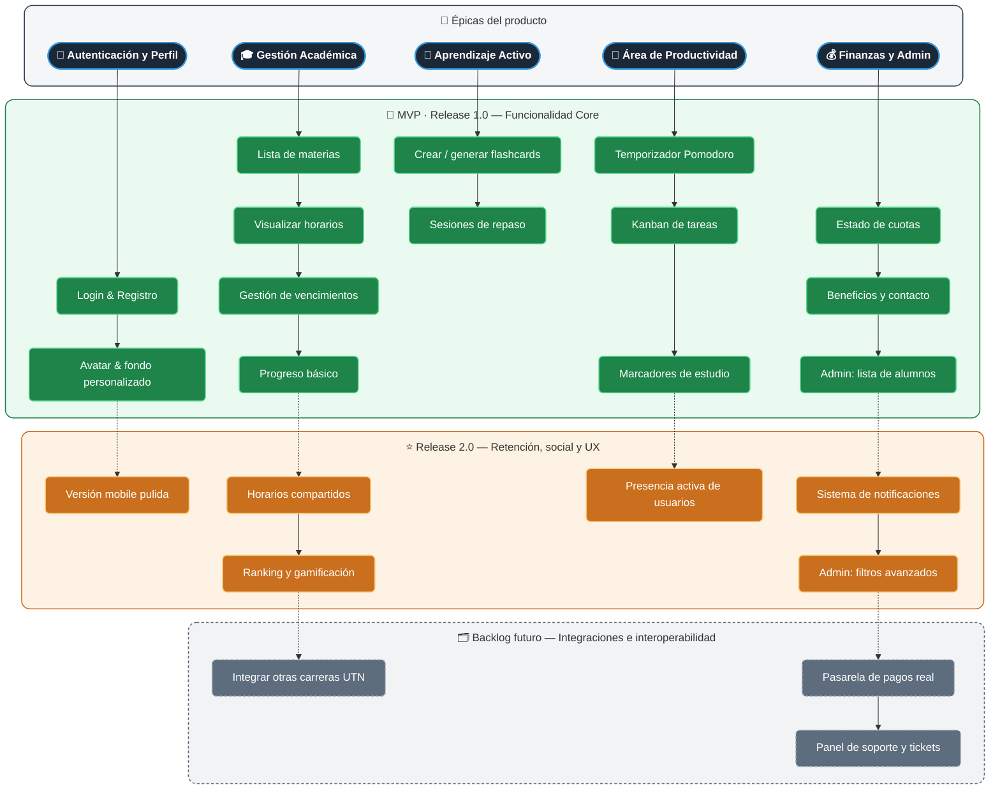

# 🗺️ Diagrama Técnico: User Story Mapping

A continuación, se presenta el User Story Mapping estructurado y visualizado como una matriz técnica.

Este diagrama está organizado jerárquicamente:

- **Nivel Superior (Fondo Oscuro):** Las 5 Épicas principales del sistema.
- **Nivel Medio (Verde):** Historias de usuario ya implementadas correspondientes al **MVP (Release 1.0)**.
- **Nivel Inferior (Naranja):** Historias planificadas a corto/mediano plazo para el **Release 2.0**.
- **Fondo (Gris):** Requerimientos de alta complejidad reservados para el **Backlog Futuro**.

_Nota: La lectura del mapa es descendente, trazando la evolución y priorización en el tiempo de cada módulo del proyecto Cursus._
